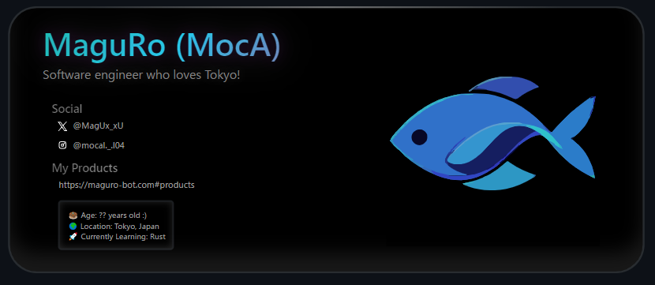

	 
	<picture>
		<source media="(min-width: 720px)" srcset="./svg/lg.svg" width="80%" height="auto">
		
	</picture>
	 

## 🛠️ Skills

### 🌐 Languages

### 🏗️ Frameworks

### ☁️ Cloud Platforms

### 🗄️ Databases

### 🎨 Prompt Engineering

## 📝 Notes
- i miss Osaka :(

## 📈 GitHub Stats

  
  

## 📫 Contact
- **X(Twitter):** [@MagUx_xU](https://twitter.com/MagUx_xU)

